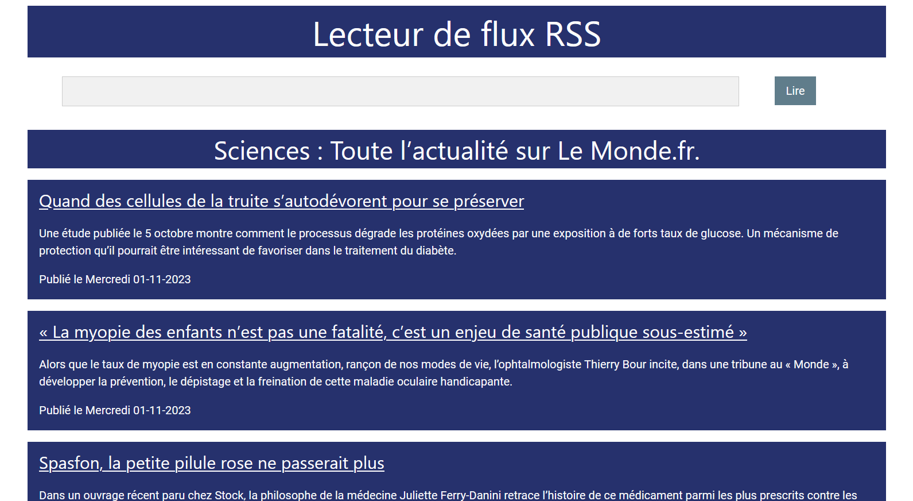

# Feed-Reader-Web

Simple feed reader web app (written with Flask) that reads a given url and displays feeds content.

Idea from [DevProjects by codementor](https://www.codementor.io/projects)

Example results:

